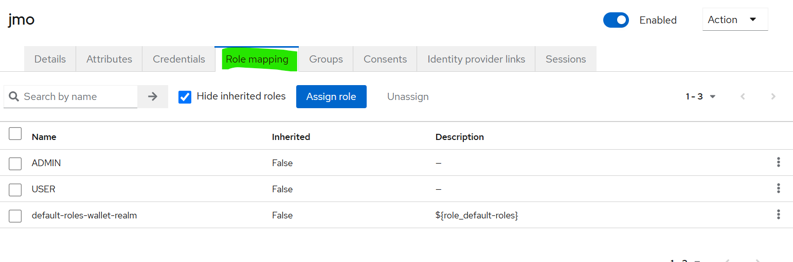
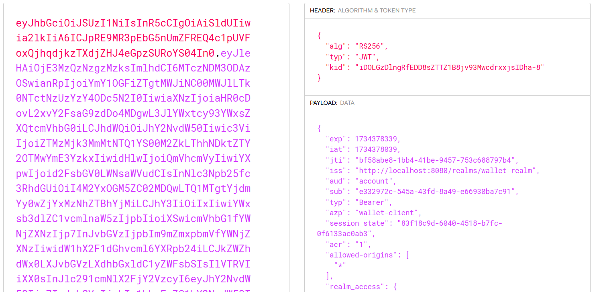

<h1>Sécurité Oauth2 OIDC et Keycloak 23</h1>

    <b><a href="https://www.keycloak.org/archive/downloads-23.0.7.html">1- Téléchargement de keycloack 23</a> </b>  
    

    <b>2- Démarrage de keycloak</b>  
    Pour le faire il faut après avoir téléchargé keycloak, il faut crééer un répertoire tools sur le disque C où le déposer  
      
    Il faut ensuite ouvrir ce répertoire à partir de l'invite de commande. Et saisir la commande suivante :
    <pre>kc.bat start-dev</pre>  Cela aura pour effet de démarrage de keycloak. Une fois le démarrage terminé il faut l'ouvrir à partir du navigateur sur l'adresse suivante <pre>localhost:8080</pre>  
    

    <b>3- Création d'un compte Admin</b>  
    Lors du lancement de la page, tu sera dirigé vers une page de création de compte admin. Tu créer le login et le mot de passe.
      
    

    <b>4. Créer un realm</b>  
    Pour creer un realm il faut se connecter à keycloak avec le compte admin qui vient d'être créer et cliquer sur la liste déroulante en haut à gauche. Une fois déroulé, il sera affiché le bouton créer un realm.
      
    

    <b>5. Créer un client à sécuriser</b>  
    Ici ont entend par client, l'application (web/mobile) qu'il faut sécuriser.  
    

    <b>6. Créer un utilisateur</b>  
    

    <b>7. Créer un role</b>  
    

    <b>8. Affecter un role à un utilisateur</b>  
    Pour affecter un role à un utilisateur il faut que l'utilisateur ai déjà été créé puis le role également.  
    Il faut cliquer sur le menu utilisateur ensuite cliquer sur le nom de l'utilisateur à qui l'ont veut assigner un role.  
      
    Une fois ces actions mené, tu clique sur l'onglet Role mapping dans l'interface qui est apparu.  
      

    <b>9. Utilisation de postman</b>  
    Afin de pouvoir utiliser postman pour faire les tests il faut aller cliquer sur le menu Realm settings. Ensuite scroller jusqu'à atteindre le lien OpenID endpoint configuration.
      
    Identifier sur la page qui va s'ouvrir le token_endpoint et le copier.  
      
    <b>- Tester l'authentification avec le mot de passe</b>  
      
      
    <b>- Analyser les contenus des deux JWT Access Token et Refresh Token</b>  
      
    <b>- Tester l'authentification avec le Refresh Token</b>  
      
      
    <b>- Tester l'authentification avec Client ID et Client Secret</b>  
    Pour ce faire, il faut au préalable aller sur client, cliquer sur le client souhaité, une fois cela effectuer il faut scroller jusqu'à atteindre la section Capability config et Client authentication qu'il faudra activer  
      
    Ensuite retourner dans postman  
      
      
    

